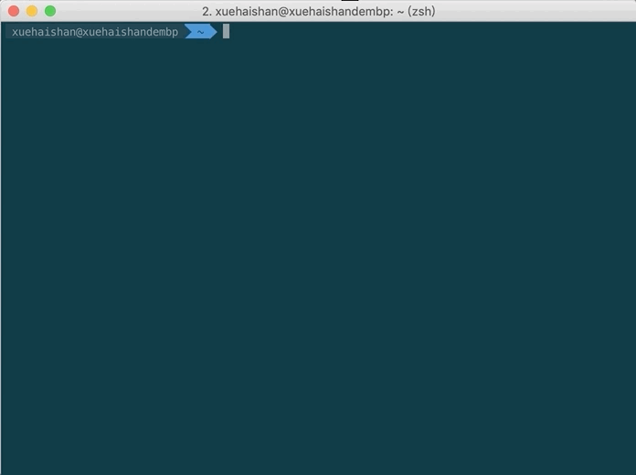

# essh

ssh 登陆管理工具



### 安装

```
go get -u github.com/seamounts/essh
```

可执行文件下载地址：[binary.tar.gz](https://github.com/seamounts/essh/releases/download/v1.0.0/binary.tar.gz)

### 配置

在用户目录创建：`.essh.yaml` 或者 `essh.yaml`

配置格式如下:

```yaml
- name: 通过密钥登陆
  user: root
  host: 1.2.3.4
  port: 22
  keypath: path-key

- name: 通过密码登陆
  user: root
  host: 5.6.7.8
  port: 22
  password: 123456

- name: 登陆后，执行shell命令
  user: root
  host: 10.2.3.4
  port: 22
  cmds:
    - cmd: ssh root@2.3.4.5

- name: 跳板机
  user: root
  host: 10.10.101.1
  port: 22
  jump:
    - user: root
      host: 10.10.101.2
      port: 22
```
